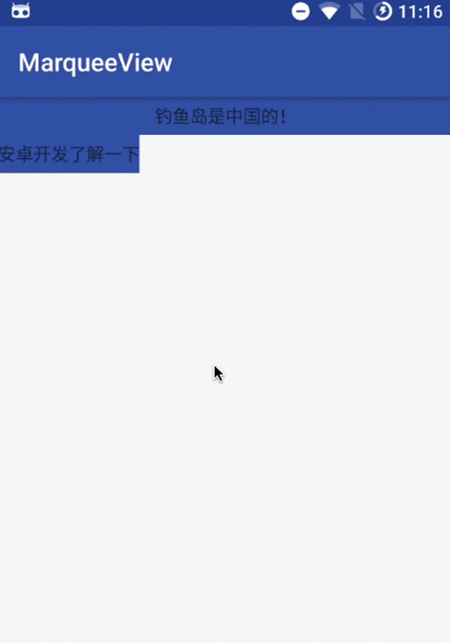

# BaseMarqueeView

快速实现跑马灯效果，就像订外卖一样简单！

## 朴素大方的效果图



## 使用方法

创建继承 BaseMarqueeView 的子类


```java
public class TextViewMarqueeView extends BaseMarqueeView<String> implements
    BaseMarqueeView.OnItemClickListener<String> {

  public TextViewMarqueeView(Context context, AttributeSet attrs) {
    super(context, attrs);
    setOnItemClickListener(this);
  }

  @Override
  protected int getRealViewCounts() {
    return 2;
  }

  @Override
  protected View onCreateView(Context context, ViewGroup parent) {
    View view = LayoutInflater.from(context).inflate(R.layout.marquee_text_item, parent, false);
    return view;
  }

  @Override
  protected void onBind(View view, String data) {
    TextView textView = (TextView) view.findViewById(R.id.text);
    textView.setText(data);
  }

  @Override
  public void onItemClick(View view, String data, int position) {
    Toast.makeText(getContext(), data, Toast.LENGTH_SHORT).show();
  }
}
```

创建视图 xml 文件，也可以不创建，在 onCreateView() 中用代码编写视图

```xml
<?xml version="1.0" encoding="utf-8"?>
<LinearLayout xmlns:android="http://schemas.android.com/apk/res/android"
  android:layout_width="wrap_content"
  android:layout_height="wrap_content"
  android:layout_gravity="center">

  <TextView
    android:id="@+id/text"
    android:layout_width="wrap_content"
    android:layout_height="wrap_content"
    android:gravity="center" />

</LinearLayout>
```

使用你的跑马灯控件

```xml
<?xml version="1.0" encoding="utf-8"?>
<LinearLayout xmlns:android="http://schemas.android.com/apk/res/android"
  android:layout_width="match_parent"
  android:layout_height="match_parent"
  android:orientation="vertical">

  <com.example.xxdr.marqueeview.TextViewMarqueeView
    android:id="@+id/marquee_view1"
    android:layout_width="match_parent"
    android:layout_height="30dp"
    android:background="@color/colorPrimary" />

  <com.example.xxdr.marqueeview.TextViewMarqueeView
    android:id="@+id/marquee_view2"
    android:layout_width="wrap_content"
    android:layout_height="30dp"
    android:background="@color/colorPrimary"
    android:measureAllChildren="false" />
</LinearLayout>
```

## 是不是很简单

## License

```
MIT License

Copyright (c) 2018 xxdr

Permission is hereby granted, free of charge, to any person obtaining a copy
of this software and associated documentation files (the "Software"), to deal
in the Software without restriction, including without limitation the rights
to use, copy, modify, merge, publish, distribute, sublicense, and/or sell
copies of the Software, and to permit persons to whom the Software is
furnished to do so, subject to the following conditions:

The above copyright notice and this permission notice shall be included in all
copies or substantial portions of the Software.

THE SOFTWARE IS PROVIDED "AS IS", WITHOUT WARRANTY OF ANY KIND, EXPRESS OR
IMPLIED, INCLUDING BUT NOT LIMITED TO THE WARRANTIES OF MERCHANTABILITY,
FITNESS FOR A PARTICULAR PURPOSE AND NONINFRINGEMENT. IN NO EVENT SHALL THE
AUTHORS OR COPYRIGHT HOLDERS BE LIABLE FOR ANY CLAIM, DAMAGES OR OTHER
LIABILITY, WHETHER IN AN ACTION OF CONTRACT, TORT OR OTHERWISE, ARISING FROM,
OUT OF OR IN CONNECTION WITH THE SOFTWARE OR THE USE OR OTHER DEALINGS IN THE
SOFTWARE.
```